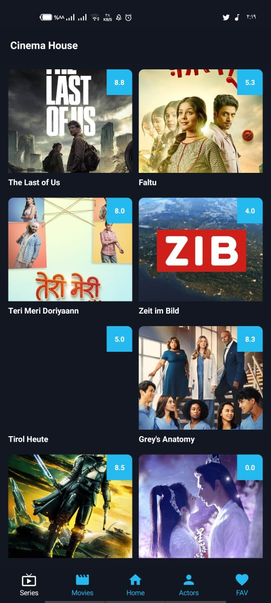
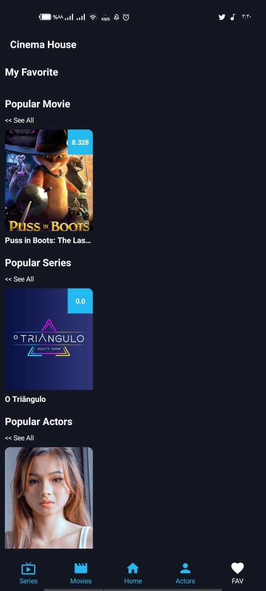

# MovieApp_CA_TDD_M
complete Movie app with many screens for movie and series and actors and favorite all above tested (Unit &amp; Integration) testing implemented with clean arch and modulrization and last tech in android.
and clean code

## ScreenShots:

  
  
  
  
  
  
  
  
  
  
  
  
  
  
  

##🌴

## Demo (please wait untill demo video loading)

  

## In-App architecture

  

## In-App Testing

  

Unit testing for:
- local insert and delete movie from fav
- remote api function getPopularMovie
- some mapper functions
- isFavorite usecase
- get Popular Actor usecase
- actor viewModel 

UI test cases:
- ActorScreen is Loading displayed

## Features
- clean code
- favorite cashing
- internet conection status
- Simple UI
- Config changes handling

## Tools & APIs
- Jetpack Compose
- Compose navigation
- Clean architecture
- mvi arch pattern
- Coroutines
- Channels & flows
- Modularization (first by feautre and by layer)
- Retrofit
- Room
- Coil
- Unit testing
- UI testing 
- firebase
- Proguard

## Resources
- API
  - [Movie API](https://www.themoviedb.org/documentation/api)
- Android Architecture and jetpack compose
  - [book Kickstart-Modern-Android-Development-Jetpack](https://www.amazon.com/Kickstart-Modern-Android-Development-Jetpack/dp/1801811075)
- Android TDD Testing
  - [bookAndroid Test-Driven Development by Tutorials](https://www.amazon.com/Android-Test-Driven-Development-Tutorials-Second/dp/1950325415)
  - And some help from chat gpt
  
  

